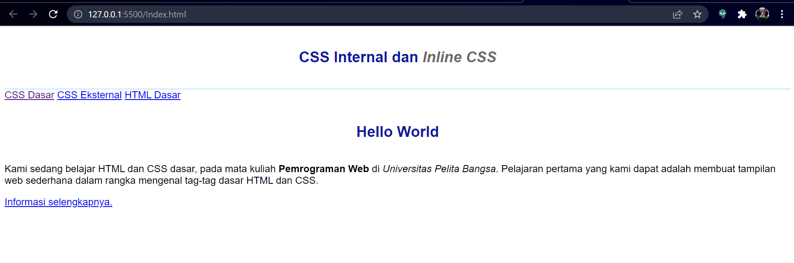
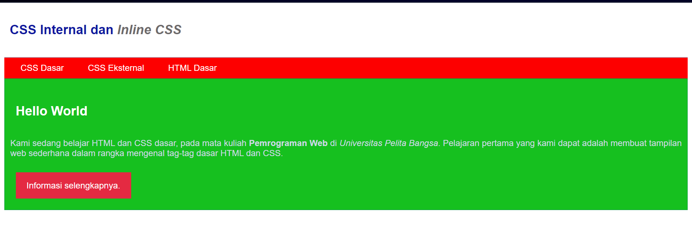

| Nama      | Shobahus Solichin |
| ----------- | ----------- |
| NIM     | 312010076       |
| Kelas   | TI.20.A.1        |

## Langkah langkah praktikum 2
Membuka text editor, Saya menggunakan Visual Studio Code 

## 1. Membuat Dokumen HTML

Buka pada browser untuk melihat hasilnya

## 2. Mendeklarasikan CSS Internal

simpan perubahan yang ada, dan lakukan refresh pada browser untuk melihat hasilnya

## 3. Menambahkan Inline CSS
tambahkan deklarasi inline CSS pada tag `
` seperti berikut

Refresh kembali browser untuk melihat perubahannya

## 4. Membuat CSS Eksternal
Buatlah file baru dengan nama style_eksternal.css kemudian buatlah deklarasi CSS seperti berikut

Kemudian tambahkan tag `<link>` untuk merujuk file css yang sudah dibuat pada bagian `<head>`

Selanjutnya refresh kembali browser untuk melihat perubahannya.

## 5. Menambahkan CSS Selektor
Selanjutnya menambahkan CSS Selector menggunakan ID dan Class Selector. Pada file style_eksternal.css, tambahkan kode berikut

Kemudian simpan kembali dan refresh browser untuk melihat perubahannya

## Pertanyaan dan Tugas
1. Lakukan eksperimen dengan mengubah dan menambah properti dan nilai pada kode CSS dengan mengacu pada CSS Cheat Sheet yang diberikan pada file terpisah dari modul ini.
2. Apa perbedaan pendeklarasian CSS elemen h1 {...} dengan #intro h1 {...}? berikan penjelasannya!
3. Apabila ada deklarasi CSS secara internal, lalu ditambahkan CSS eksternal dan inline CSS pada elemen yang sama. Deklarasi manakah yang akan ditampilkan pada browser? Berikan penjelasan dan contohnya!
4. Pada sebuah elemen HTML terdapat ID dan Class, apabila masing-masing selector tersebut terdapat deklarasi CSS, maka deklarasi manakah yang akan ditampilkan pada browser? Berikan penjelasan dan contohnya! ( `
` )

## Jawab
1. Lakukan eksperimen dengan mengubah dan menambah properti dan nilai pada kode CSS dengan mengacu pada CSS Cheat Sheet yang diberikan pada file terpisah dari modul ini.</b> 
  - Jawaban = 
Disini saya merubah font-color,fontnya saya ubah menjadi justify, contohnya pada gambar berikut :  
   
  
  - Setelah perubahan,
 

2. `h1{}` Untuk memberikan style pada semua element h1

	`#intro h1{}` Awalan simbol hash (#) memungkinkan kita untuk memberi style pada id.
	selector id bersifat kaku dan tidak bisa digunakan kembali pada element yang lainnya. Menurut saya lebih baik gunakan selektor class untuk mendefinisikan element yang ingin diberi nilai.

3. Setelah dilakukan pengujian, deklarasi CSS Inline lebih dahulu tampil di browser, itu dikarenakan permintaan HTTP yang sangat kecil memungkinkan untuk ditampilkan dahulu

	Berikut merupakan hasil pengujian deklarasi CSS

	CSS Inline `blue`
	  
	CSS Internal `red`
	
	CSS Eksternal `yellow`
	
	

4. Deklarasi `id="paragraf-1"` akan ditampilkan pada browser, karena selektor id lebih spesifik dari class atau bahkan element P itu sendiri, kecuali jika kita menambahkan property pada inline element P maka selektor id tersebut akan tertimpa, karena inline lebih spesifik daripada id, class, dan element

	